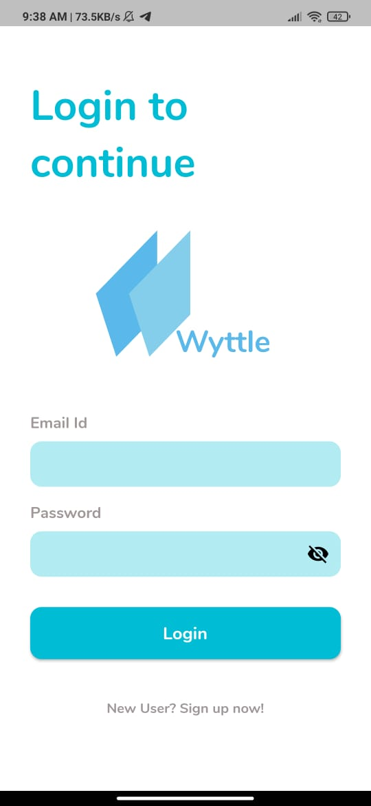
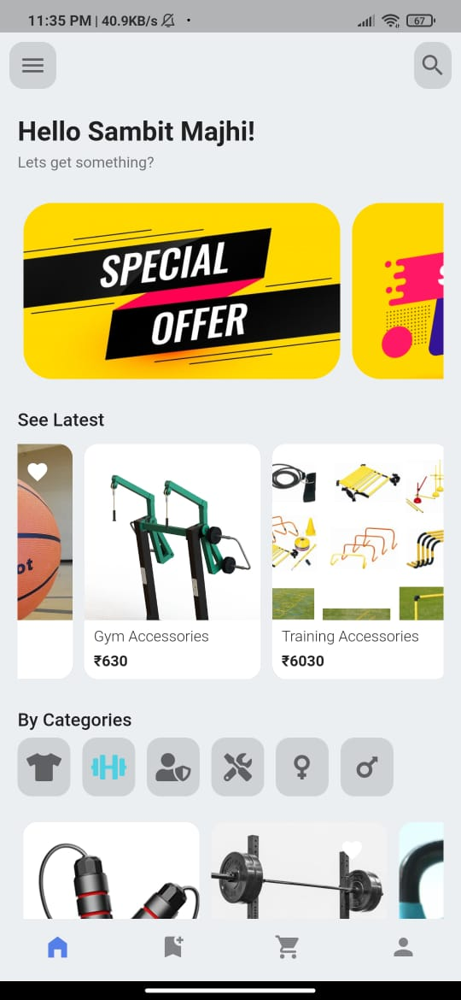
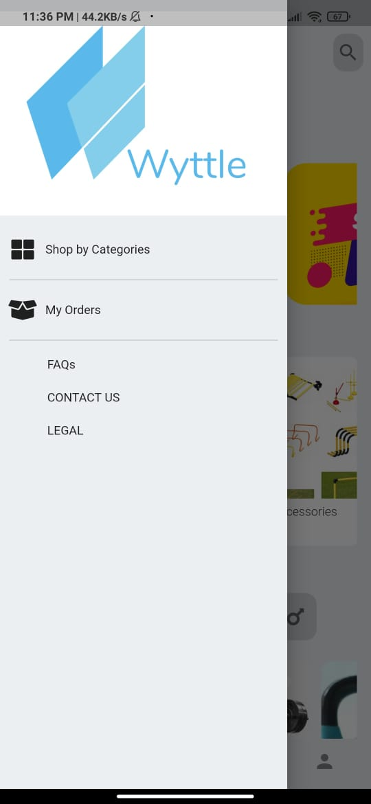
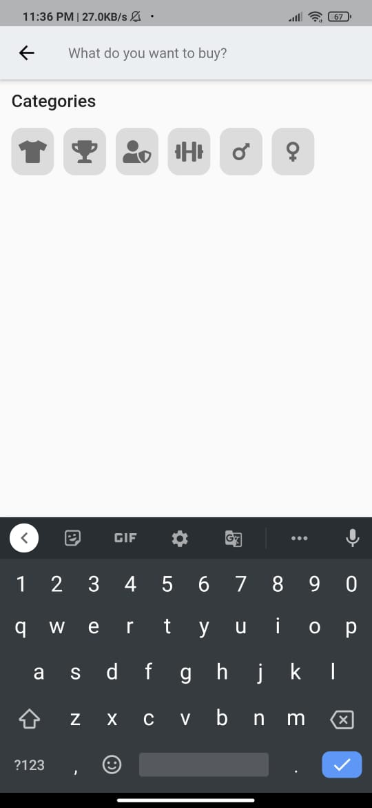
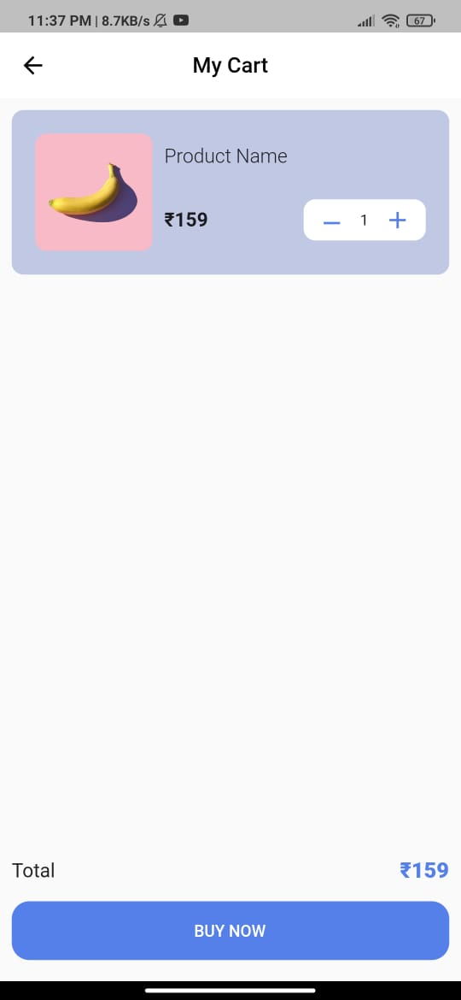
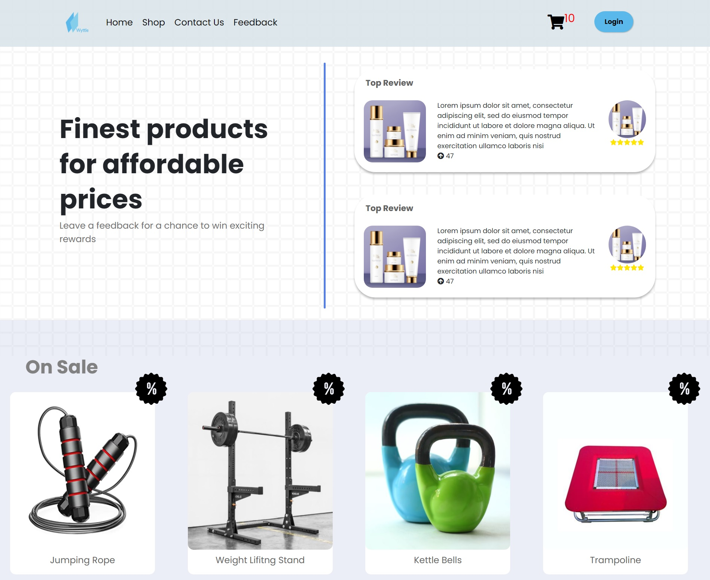
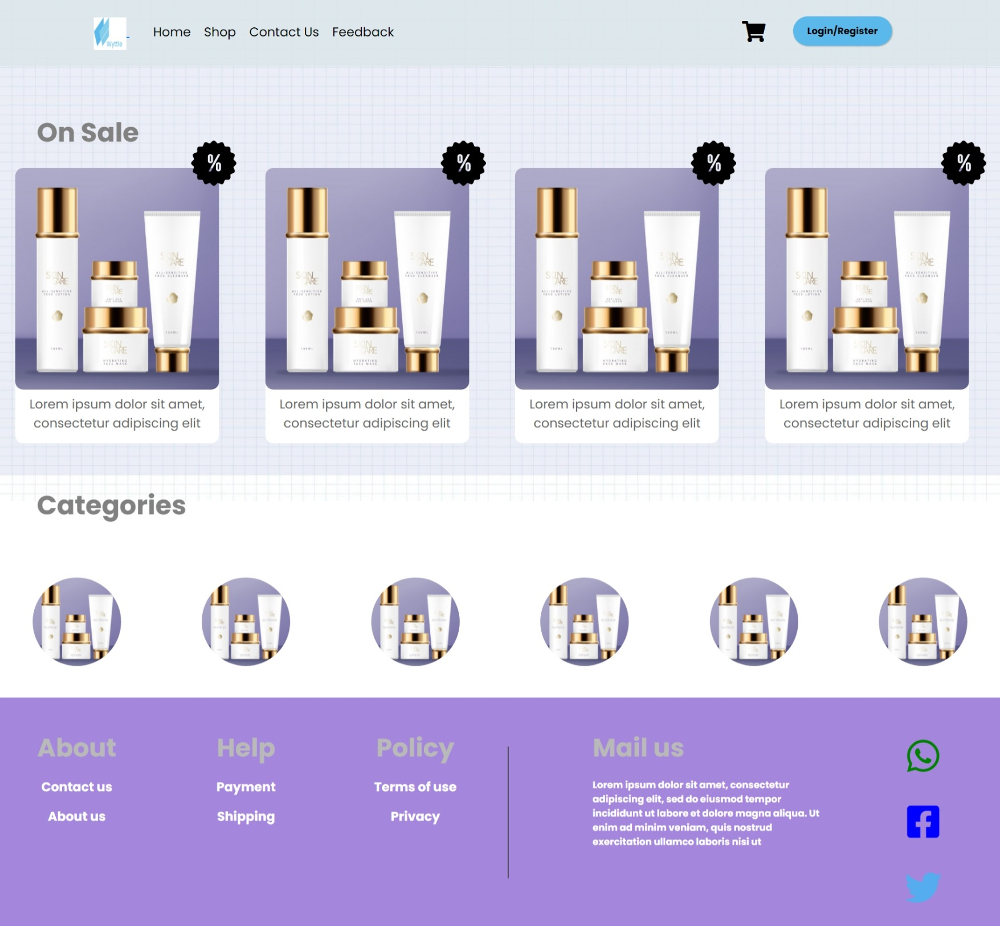
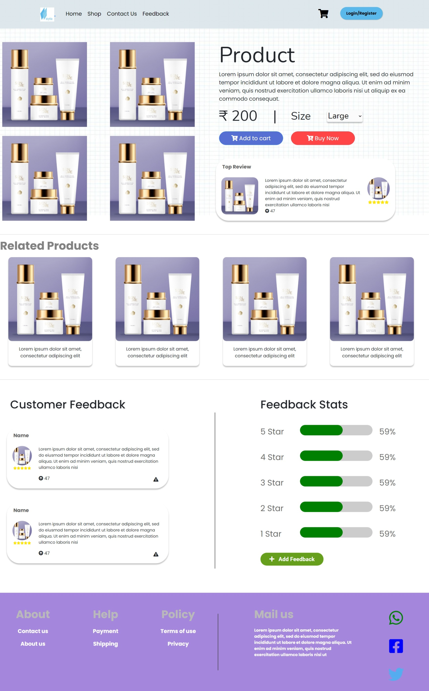
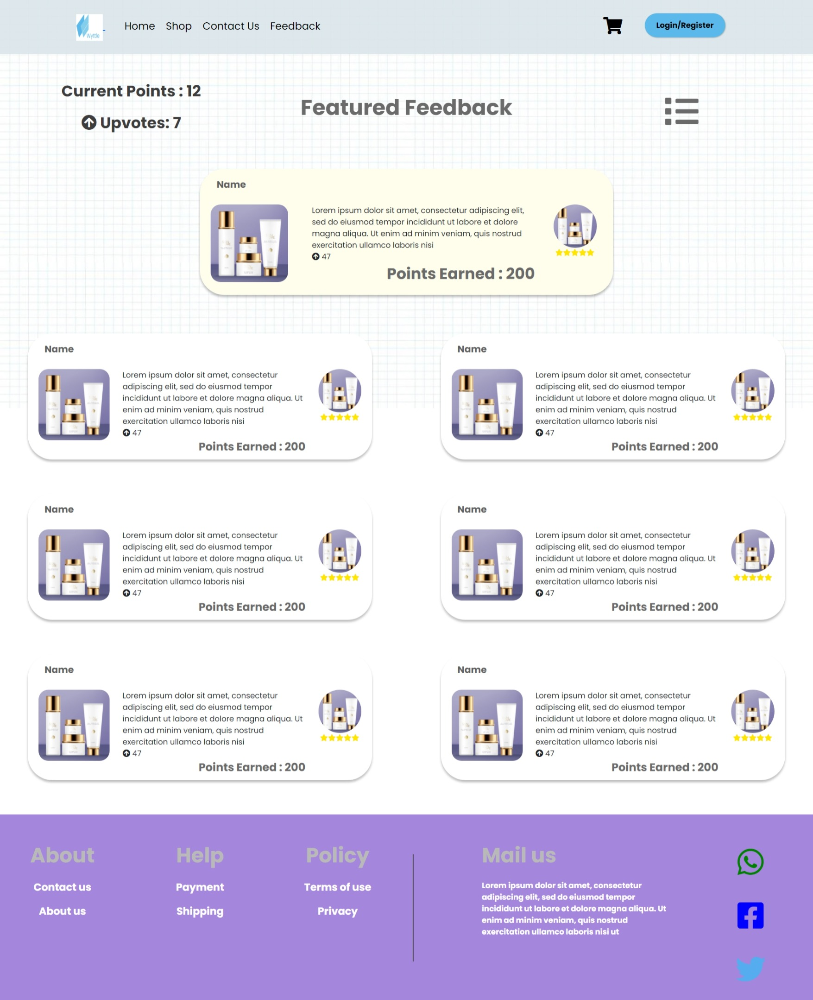
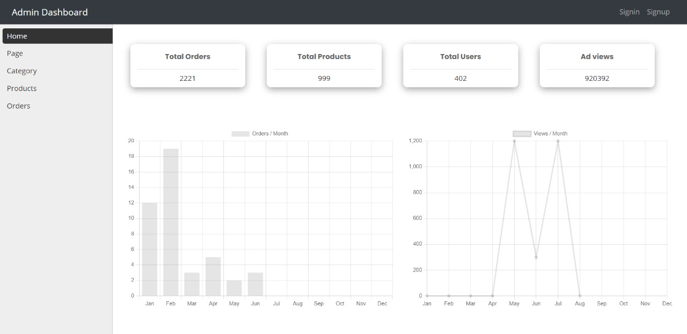

# Wyttle Web App and Mobile Application

[Link to mobile application](https://drive.google.com/drive/folders/1VFaofVO7ZtwjIsjko4sPWCz9A-ZI5873?usp=sharing)
 [Link to website](http://20.84.89.186/)

### Source Codes

[Link to Mobile Application Repository](https://github.com/WTH-CODING/wyttle_app)
 [Link to Web Application Repository](https://github.com/WTH-CODING/wyttle_web)
 [Link to Web Backend Repository](https://github.com/WTH-CODING/wyttle_backend)
 [Link to Web Admin Repository](https://github.com/WTH-CODING/wyttle_admin)

## Description

An E-Commerce sports website and app with a minimalistic and user friendly UI. Standard features include buying products
through cart system, product arrangement by categories and a robust feedback system. Consists of a reward system
that encourages leaving feedbacks on products bought.

## Feedback Structure

A user is able to leave a feedback only on products bought. The feedback is then displayed on the product page with
options for other users to upvote or report the given feedback. On reporting, feedback will be reviewed and removed
if it contains inappropriate language or is not related to the product. The more upvotes a feedback recieves the higher
chances it has to appear on the product page.

## Reward System

Points are earned based on the number of upvotes recieved on the feedback left by the users. Feedback with the highest number
of upvotes for the week will be featured in the landing page. A lucky draw system where a feedback is chosen at random consisting
of 10 upvotes or above, the feedback is then featured in the landing page. Points can then be exchanged for specific porducts or
services in the rewards page. This encourages users to leave constructive and helpful feedback on products in order to be eligible
for rewards.

## Future Plans

We plan on adding ML model to evaluate the feedback based on the type of product, use of combination of words such as "could have", "should have", "better than", etc. Also planning to tie up with the companies so that they know what the end consumer wants without having to reasearch more on their end and they can focus on building more useful product and hence the sales will increase.

###### Contributions

### Sambit Majhi:

• Backend APIs  
• App backend integration  
• App frontend (minor)  
• Server hosting  

### Rohit Sharma:

• Web Dev Backend  
• React Development  
• Web Dev Frontend (minor)  

### Pushkal Mondal:

• Web Dev UI/UX  
• Chatbot  
• Logo Design  

### Manish Bhardwaj:

• Web dev frontend (major)  
• Web dev backend (minor)  

### Shasank Periwal:

• App dev frontend (major)  
• App dev backend (minor)   

## Why did we choose Flutter and MERN

#### Flutter

Flutter is based on Google’s in-house programming language-Dart. Flutter is multi-platform portable, also with the launch of HummingBird Google has added web support to the Flutter mobile applications that use a web view control and can load and display the content dynamically without rewriting the content. Again, the windows version of an application can be made which is currently in development stage.

#### MERN

We used MERN as it facilitates the MVC (Model View Controller) architecture that make the web development process work smoothly. MERN is considered a cost-effective stack as with open-source support, accessible set-up and reduced learning time, it may have the lowest development cost. MERN framework helps to build flexible and scalable websites. The four technologies provide smooth integration with cloud platforms
  

## Few Images from the mobile application

## Few Images from User Web application

 

  

## Snapshot of Admin dashboard

